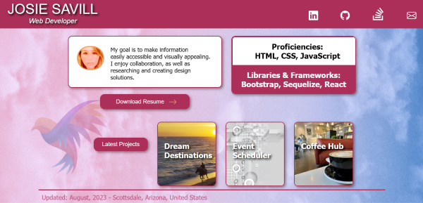
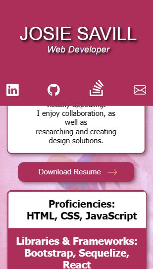

# josie-savill-portfolio

---
 

 

 JOSIE SAVILL PORTFOLIO is a place where select portfolio pieces can be showcased to prospective employers.
 
Technologies used in building this site were HTML, CSS and JavaScript.  
 

## *Description* 

## *Deployed Application URL on GitHub Pages*

//workflow

git add -A

git status

git commit -m ""

//workflow with github desktop:
2. make changes in vscode
3. open github desktop, 
4. make sure you are in the right Repository if not select 
in the dropdown to change to the correct repository
5. in the changes tab, write your commit and select "commit to main"
6. push to github.com

[Link Here](https://josiesavill.github.io/josie-savill-portfolio/)  

 